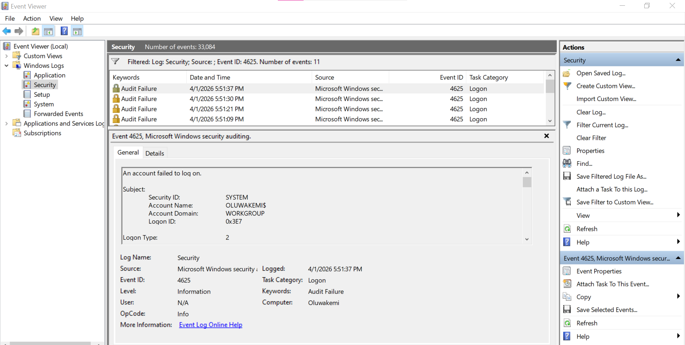
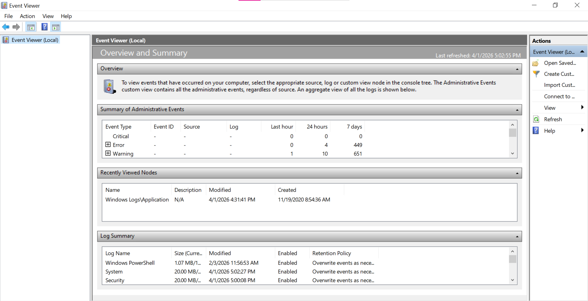
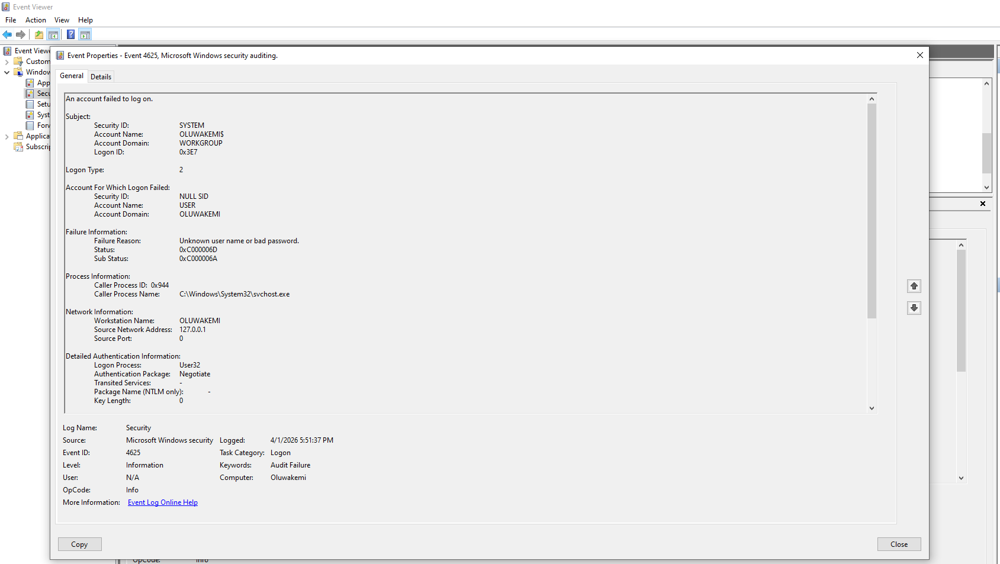
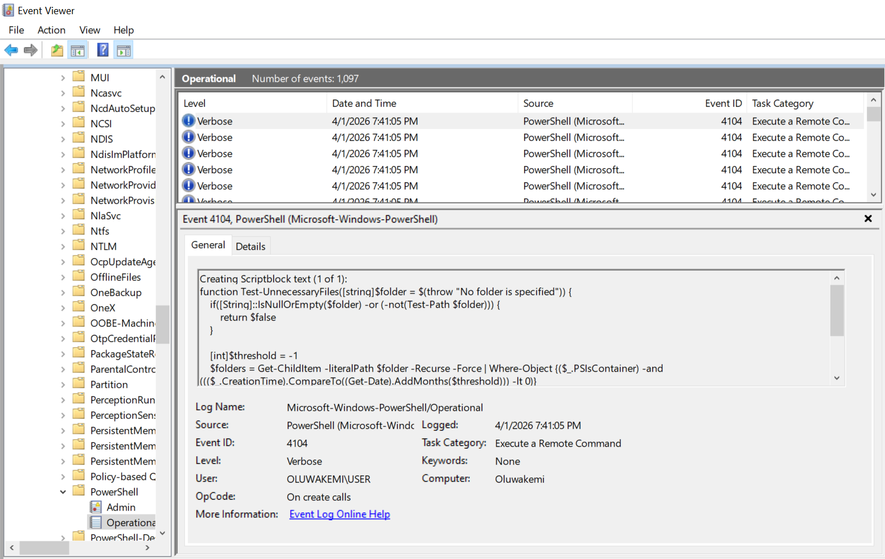
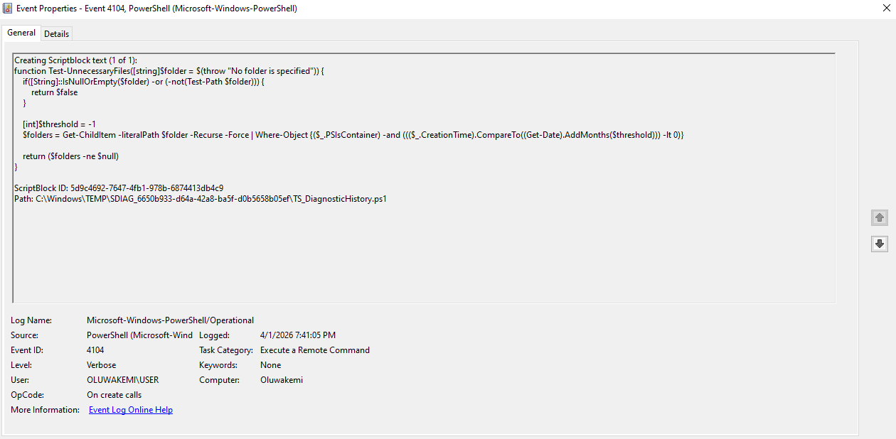

# 🛡️ SOC Analyst Lab – Threat Detection & Incident Response

## Project Overview
This repository showcases hands-on SOC Analyst skills through simulated threat detection, log analysis, phishing investigation, IOC extraction, MITRE ATT&CK mapping, and incident response documentation.

## Objectives
- Detect brute-force login attempts
- Investigate suspicious PowerShell activity
- Analyze phishing indicators
- Extract IOCs
- Map activity to MITRE ATT&CK
- Document findings in an incident report

  ## 🚨 Use Case 1: Brute-Force Login Detection
### Scenario
This case simulates a suspected brute-force attack against a Windows endpoint.

### Detection Evidence
- repeated Event ID 4625 failed logons
- same account targeted multiple times
- high-frequency authentication failures
- possible password spraying pattern

## 📸 Failed Login Investigation Evidence

### Investigation Workflow
1. Review Windows Security logs
2. Identify repeated failed logon attempts
3. Check whether a successful login followed
4. Correlate timestamps and source system
5. Escalate if credential compromise is suspected

## Tools Used
- Windows Event Viewer
- PowerShell Logs
- Sysmon
- VirusTotal
- Wireshark
- MITRE ATT&CK
- Kali Linux
- Splunk (optional)

## Use Cases
1. Brute-force login detection
2. Suspicious PowerShell activity
3. Phishing email analysis

## Repository Structure
- `images/` → screenshots and evidence
- `logs/` → exported logs or text samples
- `detection-rules/` → detection logic and analyst notes
- `incident-reports/` → investigation writeups
- `mitre-mapping/` → MITRE ATT&CK technique mapping

## Key Skills Demonstrated
- Log triage
- Event correlation
- IOC extraction
- Threat investigation
- Incident documentation
- Security reporting

## 🖥️ Event Viewer Overview

### Failed Login Events

### Failed Login Event Details

## 📸 Suspicious PowerShell Investigation Evidence

### PowerShell Log Overview

### PowerShell Event Log

### PowerShell Event Details

